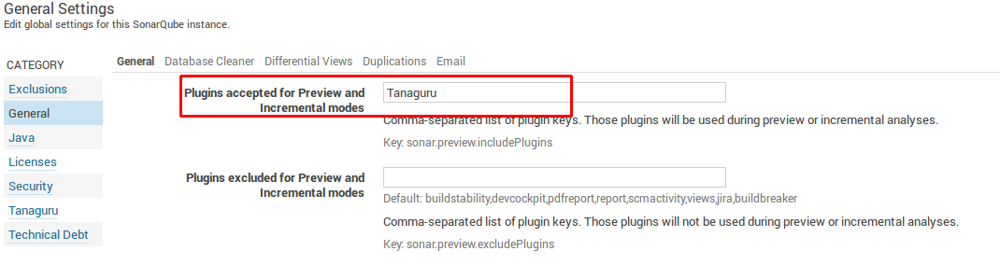
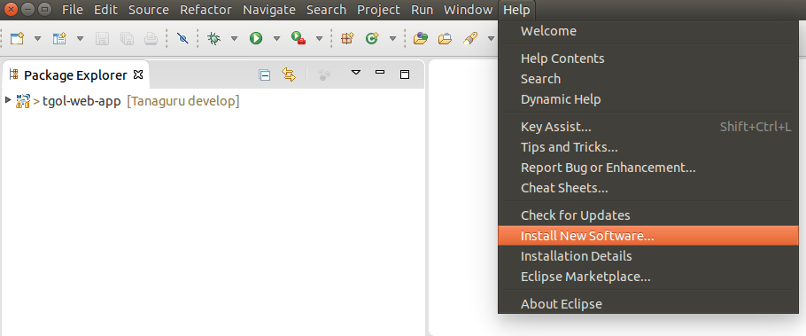
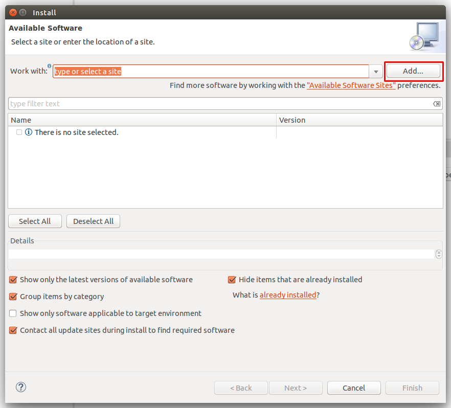
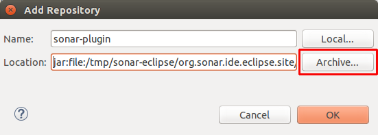
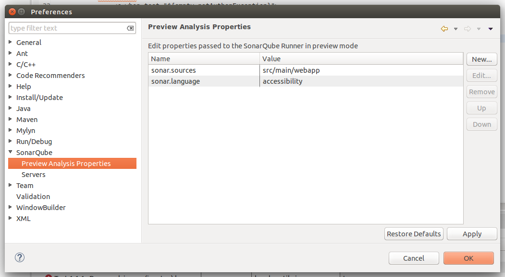
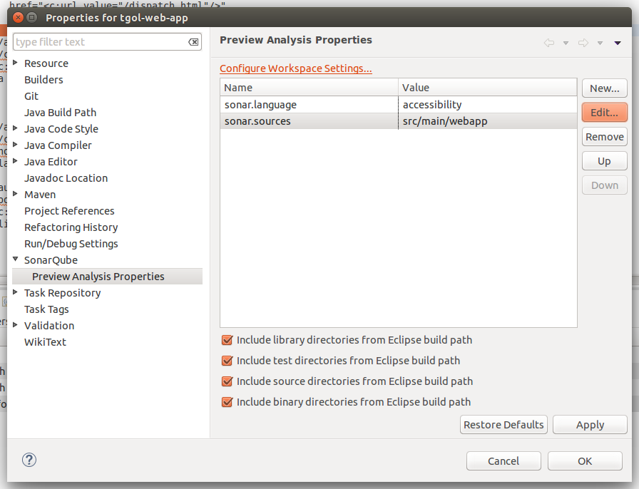
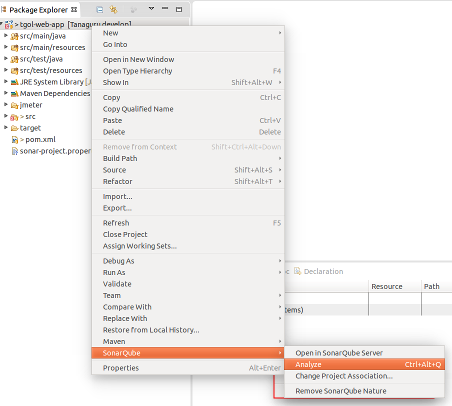
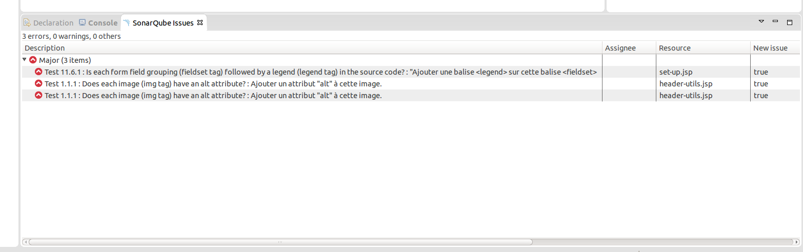

# Run Tanaguru analysis with SonarQube Eclipse plugin

**Warning1** : This functionnality only works with SonarQube from version 4.5.2.

**Warning2** : Ensure you've added Tanaguru as Plugins accepted for Preview and Incremental modes in SonarQube general settings panel.

## Download Sonar Eclipse plugin

Download [our version of the plugin](http://download.tanaguru.org/Tanaguru-sonar-plugin/sonar-eclipse.zip).

## Install the plugin

From the menu, select "Help" => "Install New Software..."

Click on "Add" button.

Fill-in a name (let's say "sonar-plugin") and select the zip archive from your file system by clicking on "Archive" button.

Then, terminate the installation by clicking on "Next" until the end and restart Eclipse.

## Configure the plugin

Open the Preference dialog ("Window" => "Preferences"). 
A SonarQube entry is now present on left menu.

Select the submenu "*Preview Analysis Properties*" and add the following properties  : 

* *sonar.language* with value *accessibility*
* *sonar.sources* with path to your files (multiple paths can be set, separated by a comma ',')

This way, your plugin is set to perform accessibility analysis on all projects.

To configure accessibility analysis only on some projects, right click on your project and select "Properties" (or Alt+Enter).

As previously, a SonarQube entry is now present on left menu.

You have to add the properties from this menu as described previously. The configuration is thus only applied on the current project.

## Perform analysis

To perform analysis, right click on the project you want to test and select SonarQube => Analyze (or Ctrl+Alt+Q).

The results are now accessible within the "SonarQube issue" window, and you can access the error on the source code by double clicking on any issue.

## Next step

* proceed to [Run with SonarQube Runner](run-with-sonar-runner.md)
* proceed to [Run with Maven](run-with-maven.md)
* proceed to [Run with SonarQube Jenkins plugin](run-with-jenkins.md)
