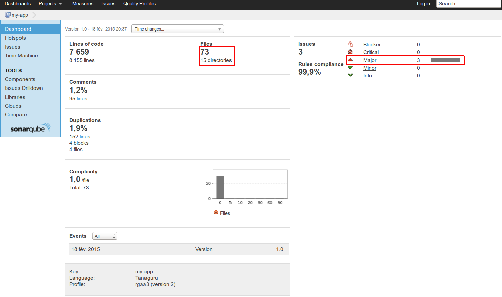
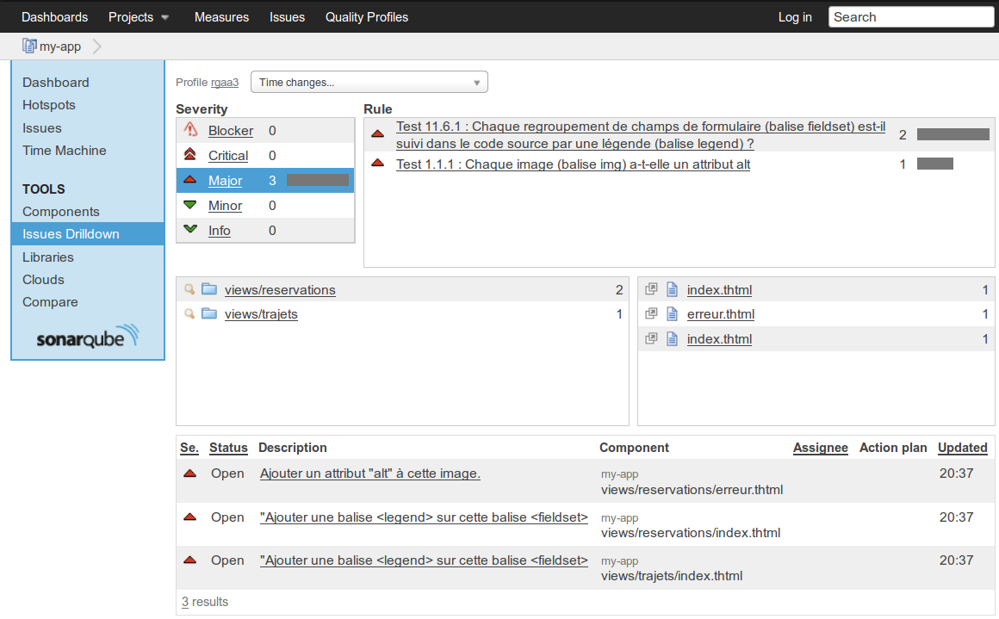

# Run Tanaguru analysis with the SonarQube Runner

You can have all the details about usage and set-up in the [official *Analyzing with SonarQube Runner* page](http://docs.sonarqube.org/display/SONAR/Analyzing+with+SonarQube+Runner).

## Concrete example

Let's give an example of a *sonar-project.properties* file that can be used to perform an analysis with the Tanaguru plugin.

``` php
# Required metadata
sonar.projectKey=my:project
sonar.projectName=My project
sonar.projectVersion=1.0
 
# Path to the parent source code directory.
# Path is relative to the sonar-project.properties file. Replace "\" by "/" on Windows.
# Since SonarQube 4.2, this property is optional if sonar.modules is set. 
# If not set, SonarQube starts looking for source code from the directory containing 
# the sonar-project.properties file.
sonar.sources=src
 
# Encoding of the source code
sonar.sourceEncoding=UTF-8
 
# Additional parameters
sonar.language=accessibility
```

Once created and copied in the root directory of the project, run the following command from the project base directory to launch the analysis :

``` sh
sonar-runner
```

## Result of the analysis

The result of the analysis is now available from the SonarQube web interface (accessible for a default installation at the URL http://localhost:9000/)

The Tanaguru plugin analyzes HTML within any language, such as PHP, JSP, or whatever and produces a synthesis that contains metrics such as :

* The list of the issues sorted by their severity
* The number of tested files and lines of code



Clicking on each *severity* link in the list of the issues leads to the details of the errors, pointing precisely the problem in the source code (type of error, file, and line number).



## Parsed files

The analysed files are the files present in the directory set by the *sonar.sources* property that matches one of the [file suffixes set for the plugin](sonar-runner-launch.md#list-of-suffixes-for-files-to-analyze)


## Next step

* proceed to [Run with Maven](run-with-maven.md)
* proceed to [Run with SonarQube Jenkins plugin](run-with-jenkins.md)
* proceed to [Run with SonarQube Eclipse plugin](run-with-eclipse.md)
