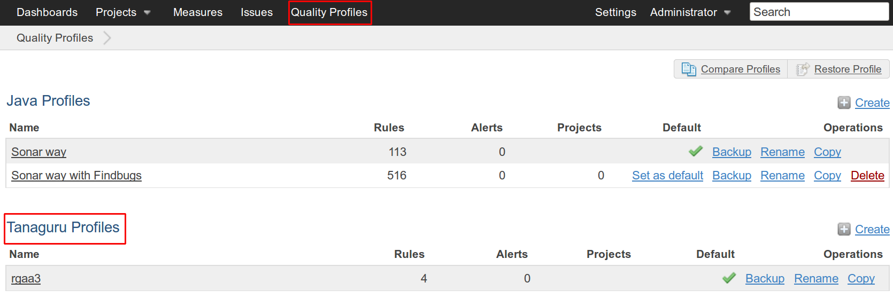
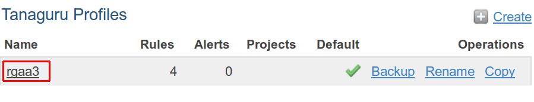
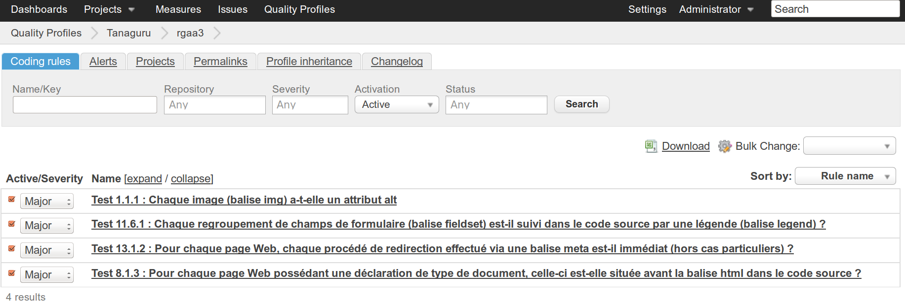
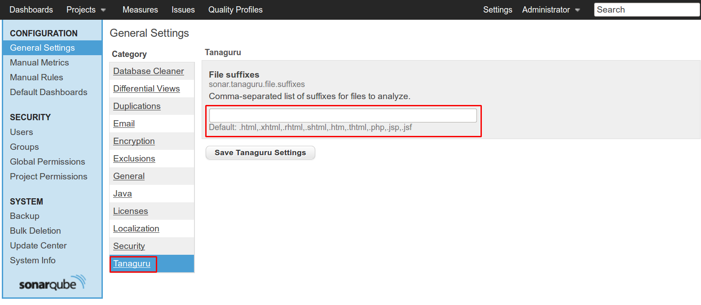
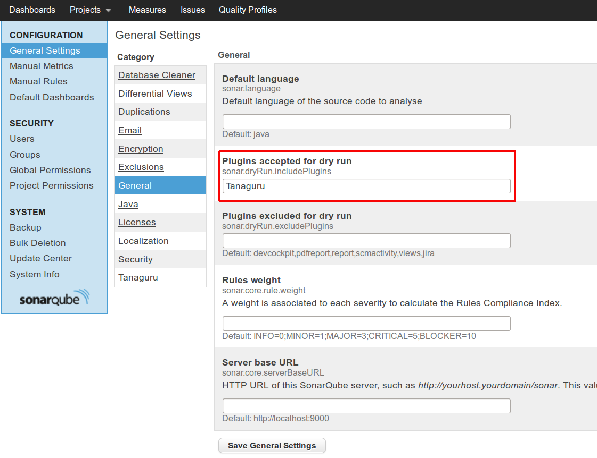

# Configuration of Asqatasun SonarQube plugin

Once the plugin is installed, Asqatasun profiles are now available from the Quality Profiles page.

The associated language of the Asqatasun Profiles is **accessibility** and the default profil is **rgaa3**.

## The default profile : rgaa3

To see details about the rules of the **rgaa3** profile, click on the **rgaa3** link in the Quality Profiles page.

By now, 4 rules are implemented and they are all activated by default, with a *Major* severity level.

You can customize this default rule set by activating/desactivating and changing the severity level of each rule from this page.
The changes are automatically saved.

## List of suffixes for files to analyze.

The plugin will, by default, analyze the files with the following extensions : 

* .html
* .xhtml
* .rhtml
* .shtml
* .htm
* .thtml
* .php
* .jsp
* .jsf

If the extension of the files you're about to analyze is not among this list, you need to go to the *General Settings* page.

To do so, login with an administrator account and click on the *Settings* link that appeared on the top bar menu.

*Asqatasun* is present in the category list, and its selection leads to the *Asqatasun settings page*.

Here, you can add the extensions, in the dedicated textfield : each extension needs to be prefixed by "." .
Validate your modifications by clicking on the *Save Asqatasun Settings* button.

**Note** : The addition of one or several extensions doesn't preserve the default values. Start by copying and pasting the default list in the textfield before adding new extensions.

## Add Asqatasun plugin in plugin list accepted for dry run

Regarding the way you launch analysis, you may need to activate the "dry run" mode of SonarQube for the Asqatasun plugin.

This mode consists in performing a full analysis, without storing the results in the database.

To do so, go to the *General* category of the *General Settings* page and add *Asqatasun* in *Plugins accepted for dry run* field.

## Next steps

The plugin is now installed and set-up. Regarding the kind of analysis you want to perform, go to the appropriate page for client set-up and usage
run-with-eclipse-plugin.md
* proceed to [Run with Sonar Runner](run-with-sonar-runner.md)
* proceed to [Run from Maven](run-with-maven.md)
* proceed to [Run from SonarQube Jenkins plugin](run-with-jenkins.md)
* proceed to [Run from SonarQube Eclipse plugin](run-with-eclipse.md)
